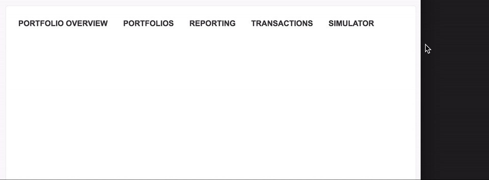

# Reducible Navigation for React.js

[]()

> A responsive horizontal navigation which adds a dropdown as soon as not all items can be shown anymore which only holds not shown items.



## Navigation reducible in action

For examples visit our storybook entry https://engineering.liqid.de/navigation-reducible.

## Setup

### Prerequisites
* [Node / NPM](https://www.npmjs.com/)
* [NVM](https://github.com/creationix/nvm)

### Install
* `npm install liqid-navigation-reducible`

> Important: Make sure to include the SCSS / CSS

### Usage
```js
import NavigationReducible from 'navigation-reducible';

ReactDOM.render((
    <NavigationReducible>
        <div onClick={this.doSomething}>
            {'First item'}
        </div>
        <div onClick={this.doSomethingElse}>
            {'Second item'}
        </div>
    </NavigationReducible>
), document.getElementById('slider-root'));
```

### Live Demo

For an example you can check out the storybook.

* Clone the repository.
* `npm install`
* `npm run storybook`
* Visit `http://localhost:9001/`.
